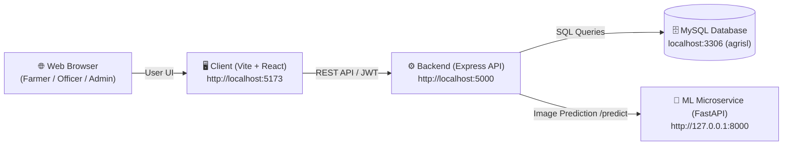
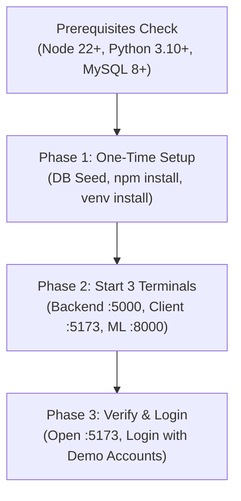

# CLAUDE.md

This file provides guidance to Claude Code (claude.ai/code) and developers working with code in this repository.

---

## System Architecture & Execution Flow

AgriSL runs as **three coordinated services** communicating locally:



### Services Overview

| # | Service | Tech Stack | Port | Working Directory | Purpose |
|---|---|---|---|---|---|
| **1** | **Backend API** | Node.js, Express, MySQL2 | `5000` | `server/` | Auth, DB operations, AI orchestration |
| **2** | **Frontend Web** | React 19, Vite, MUI | `5173` | `client/` | Responsive UI (Sinhala & English) |
| **3** | **ML Microservice** | Python 3.10+, FastAPI, TensorFlow | `8000` | `ml-service/` | Local leaf disease classification (15 classes) |

---

## Running Instructions (Streamlined Flow)

Follow this 3-phase flow to get the entire platform up and running.



### Phase 1: One-Time Setup (Run Once)

#### Step 1.1: Database Setup
Ensure MySQL is running on `localhost:3306`.
```bash
# In MySQL client / CLI:
CREATE DATABASE IF NOT EXISTS agrisl CHARACTER SET utf8mb4 COLLATE utf8mb4_unicode_ci;

# Run the migration to create tables & seed 3 official demo accounts:
cd server
npm install
npm run migrate
```

#### Step 1.2: Frontend Setup
```bash
cd client
npm install
```

#### Step 1.3: Python ML Microservice Setup
```bash
cd ml-service

# Create and activate Python virtual environment:
# Windows (PowerShell):
python -m venv venv
.\venv\Scripts\Activate.ps1

# Windows (Command Prompt):
python -m venv venv
venv\Scripts\activate.bat

# macOS / Linux:
python3 -m venv venv
source venv/bin/activate

# Install dependencies inside venv:
pip install -r requirements.txt

# Verify required model files exist:
# ml-service/model/disease_model.keras  (Trained weights)
# ml-service/model/class_names.json     (15 disease label names)
```

---

### Phase 2: Daily Running Flow (3 Terminals)

Open **three separate terminal tabs/windows** and start each process:

#### 🟢 Terminal 1: Backend API
```powershell
# Directory: AgriSL/server
cd server
npm run dev
```
* **Success Output:** `Server running on port 5000` & `Connected to MySQL database: agrisl`
* **Health Check:** [http://localhost:5000/api/health](http://localhost:5000/api/health)

#### 🔵 Terminal 2: Frontend Web App
```powershell
# Directory: AgriSL/client
cd client
npm run dev
```
* **Success Output:** `VITE v... ready in ... ms ➜ Local: http://localhost:5173/`
* **App URL:** [http://localhost:5173](http://localhost:5173)

#### 🟣 Terminal 3: ML Microservice
```powershell
# Directory: AgriSL/ml-service
cd ml-service
.\venv\Scripts\Activate.ps1
uvicorn main:app --host 127.0.0.1 --port 8000 --reload
```
*(On macOS/Linux use `source venv/bin/activate` instead of `.ps1`)*
* **Success Output:** `Uvicorn running on http://127.0.0.1:8000` & `Application startup complete.`
* **Health Check:** [http://127.0.0.1:8000/health](http://127.0.0.1:8000/health)
* **Interactive Docs:** [http://127.0.0.1:8000/docs](http://127.0.0.1:8000/docs)

> 💡 **Graceful Fallback:** Terminal 3 is optional for UI browsing. If the ML service is offline, the backend automatically falls back to Kindwise `crop.health` → Gemini/OpenAI vision.

---

### Phase 3: 30-Second Verification & Demo Logins

1. Open your browser to **[http://localhost:5173](http://localhost:5173)**.
2. Sign in with any of the pre-seeded demo accounts:

| Role | Email | Password | Permissions & Notes |
|---|---|---|---|
| 👑 **Admin** | `admin@agrisl.lk` | `admin123` | Full dashboard, approve officers, view all reports |
| 🌾 **Farmer** | `farmer@agrisl.lk` | `farmer123` | AI Chatbot, upload crop leaf photos for diagnosis |
| 🛡️ **Officer** | `officer@agrisl.lk` | `officer123` | Publish advisory articles, review farmer disease reports |

---

## Architecture

**Monorepo Structure:**
- `server/` — Express.js + MySQL backend; handles auth, file uploads, AI chat, disease detection, advisory articles
- `client/` — React 19 + Vite SPA; Material UI (green primary `#2E7D32`, amber secondary `#F57F17`); supports Sinhala (Noto Sans Sinhala) + English

**Database Schema (8 tables):**
1. **users** — farmers, officers, admins; includes role-based access control, approval status for officers
2. **chat_sessions** — AI chatbot sessions (crop advice, language: en/si)
3. **chat_messages** — individual messages in a session (role: user/assistant)
4. **disease_reports** — crop disease detection (with image, AI confidence, treatments in both languages, officer assignment)
5. **advisory_articles** — articles authored by officers (bilingual, categories: crop management, pest control, seasonal planting, etc.)
6. **article_ratings** — user ratings (1-5) on articles (one per user per article)
7. **bookmarks** — user bookmarks of articles (one per user per article)
8. **notifications** — system notifications to users

**Authentication:**
- JWT tokens stored in `localStorage` as `agrisl_token`
- Bearer token attached to all API requests via axios interceptor (`client/src/api/axios.js`)
- Tokens issued on login, validated server-side

**File Uploads:**
- Multer configured; files stored in `server/uploads/`
- Served at `GET /uploads/<filename>`

## Server API Structure

- `routes/` — Endpoint definitions (auth, chat, disease detection, articles, etc.)
- `controllers/` — Business logic for each route
- `middleware/` — JWT auth/role guards (`auth.js`) and image-upload handling (`upload.js`)
- `db/` — Database connection pool (`db.js`), schema (`init.sql`), migration runner (`migrate.js`)
- `.env` — Database credentials, JWT secret, OpenAI API key, port

**Key env vars:**
```
DB_HOST=localhost
DB_USER=root
DB_PASS=<password>
DB_NAME=agrisl
JWT_SECRET=<random secret for signing JWTs>
AI_PROVIDER=gemini            # openai | gemini | groq
GEMINI_API_KEY=<free key from aistudio.google.com/apikey>
GROQ_API_KEY=<free key from console.groq.com — powers chat + Sinhala translation>
OPENAI_API_KEY=<only used when AI_PROVIDER=openai>
PLANTNET_API_KEY=<free key from my.plantnet.org — optional; grounds disease detection>
CROP_HEALTH_API_KEY=<free key from admin.kindwise.com — optional; PRIMARY disease detector>
PORT=5000

# ── Python ML Microservice (Detector C) ──────────────────────────────────────
# Set both to the FastAPI service URL to enable the custom MobileNetV2 model
# as the FIRST disease detector (runs before crop.health / Gemini).
# Leave blank to disable — detection falls back to crop.health → Gemini.
DISEASE_MODEL_URL=http://127.0.0.1:8000
ML_SERVICE_URL=http://127.0.0.1:8000
```

**Disease detection pipeline — 3-tier cascade (`/api/disease`):** The endpoint runs detectors in descending order of speed and independence:
1. **Custom Python ML Microservice** (`server/ml/diseaseModel.js` → `http://127.0.0.1:8000/predict`) — the FIRST detector. If `ML_SERVICE_URL` is set and the service is reachable, it runs the trained MobileNetV2 model locally in ~50ms. If confidence is high, it provides the diagnosis immediately.
2. **Kindwise crop.health** (`server/utils/cropHealthClient.js`) — the SECOND detector, used if ML microservice is offline or unconfigured. Uses purpose-built agricultural ML via API key.
3. **AI Vision Model** (Gemini/OpenAI via `server/utils/openaiClient.js`) — the FINAL FALLBACK. Used if both previous tiers are unavailable. Translates findings to Sinhala and English.

All AI calls go through `server/utils/aiRetry.js` (`withAIRetry`), which retries
transient 429/5xx rate-limit/overload errors with exponential backoff so brief
free-tier limits recover automatically instead of failing the request.

**PlantNet (species grounding):** Before the AI diagnosis, `/api/disease` calls
PlantNet (`server/utils/plantNetClient.js`) to identify the plant *species* from
the uploaded photo. PlantNet does **not** diagnose diseases — it returns the
species + a match score, which is (a) fed into the AI vision prompt to ground the
diagnosis on the correct plant and (b) stored on the report (`identified_species`)
and returned to the client as a `plantnet` object. It degrades gracefully: if
`PLANTNET_API_KEY` is unset, the plant can't be recognised, or the call fails,
`identifyPlant()` returns `null` and detection falls back to AI-only. PlantNet is
skipped entirely under `NODE_ENV=test`.

**AI provider switch:** `server/utils/openaiClient.js` selects the AI backend from
`AI_PROVIDER`. All providers speak the OpenAI Chat Completions API, so the same
`openai` SDK is reused — only base URL, key, and model differ. `gemini` (default)
is free and supports both chat and vision (disease detection); `groq` is free but
text-only (chat only); `openai` is paid. Override the model with `AI_MODEL`.

## Client Structure

- `src/main.jsx` — React root with BrowserRouter, MUI ThemeProvider
- `src/App.jsx` — Placeholder for main routing
- `src/api/axios.js` — Pre-configured axios instance (baseURL: `http://localhost:5000/api`, auth interceptor)
- `src/index.css`, `App.css` — Global styles
- Font imports: Roboto (en), Noto Sans Sinhala (si)

**Bilingual note:** App supports both English and Sinhala; the advisory articles and chat endpoints accept a `language` param (en/si). Font stack in theme ensures both render correctly.

## Common Commands

### Server (Terminal 1)

```bash
cd server

# Development
npm run dev          # Auto-reload with nodemon → http://localhost:5000
npm run start        # Run once (no auto-reload)

# Database
npm run migrate      # Create tables + seed 3 demo accounts

# Verify server health
curl http://localhost:5000/api/health
# Expected: {"status":"ok","service":"AgriSL API"}
```

### Client (Terminal 2)

```bash
cd client

# Development
npm run dev          # Vite dev server → http://localhost:5173
npm run build        # Production bundle (outputs to client/dist/)
npm run preview      # Preview production build locally
npm run lint         # ESLint check
```

### ML Microservice (Terminal 3)

The Python FastAPI microservice lives in `ml-service/`. It loads the trained
MobileNetV2 Keras model (`ml-service/model/disease_model.keras`) and serves
image predictions at `POST /predict`.

```bash
cd ml-service

# ── First-time setup ──────────────────────────────────────────
# Requires Python 3.10+. Check version:
python --version
# or on some systems:
python3 --version

# (Recommended) Create an isolated virtual environment:
python -m venv venv

# Activate the virtual environment:
# Windows (PowerShell):
.\venv\Scripts\Activate.ps1
# Windows (CMD):
venv\Scripts\activate.bat
# macOS / Linux:
source venv/bin/activate

# Install dependencies:
pip install -r requirements.txt

# ── Run the microservice ──────────────────────────────────────
uvicorn main:app --host 127.0.0.1 --port 8000
# → API:  http://127.0.0.1:8000
# → Docs: http://127.0.0.1:8000/docs  (Swagger UI — test /predict here)
# → Health check: http://127.0.0.1:8000/health

# Auto-reload during development (reloads on file save):
uvicorn main:app --host 127.0.0.1 --port 8000 --reload

# ── Verify the service is running ────────────────────────────
curl http://127.0.0.1:8000/health
# Expected: {"status":"ok"}

# ── Stop the service ─────────────────────────────────────────
# Press Ctrl+C in Terminal 3
```

**Required model files** (must exist before starting):
```
ml-service/
  model/
    disease_model.keras    ← trained Keras model (not in git — too large)
    class_names.json       ← list of class labels, e.g. ["Apple_Scab", ...]
  main.py
  requirements.txt
```

> ⚠️ If `model/disease_model.keras` is missing, the ML service will crash on
> startup. Either train the model (see `DISEASE_DETECTION_ML.md`) or leave
> `DISEASE_MODEL_URL` blank in `.env` to skip the ML service entirely.

**Connect ML service to the Express server** — ensure `server/.env` has:
```env
DISEASE_MODEL_URL=http://127.0.0.1:8000
ML_SERVICE_URL=http://127.0.0.1:8000
```
Then restart the backend (`npm run dev` in Terminal 1). The next disease
detection upload will route through the ML model first.

## Key Design Notes

1. **Separate concerns:** Server is API-only; client is a pure SPA (no server-side rendering). They communicate via REST + JSON.

2. **Officer approval flow:** Officers sign up with `is_approved=0` by default (see `users` table). Only admins can approve them. Farmers default to `is_approved=1`.

3. **Disease detection integration:** `/api/disease` runs a hybrid pipeline — PlantNet identifies the plant species (real ML, stored in `identified_species`), then the AI vision model uses that ID to fill `disease_name`, `confidence_level`, `symptoms`, and `treatment_*` in both languages. See the PlantNet note under *Server API Structure*.

4. **Chat sessions are language-scoped:** Each session has a `language` (en/si). Messages in a session should be in that language.

5. **Uploads are relative to `server/uploads/`:** Ensure `server/uploads/.gitkeep` exists so the folder is tracked by git. Actual uploads are in `.gitignore`.

6. **No static frontend serving from Express:** The client runs on its own dev server (`:5173`) during development. In production, the client would be built and served separately (or proxied via nginx, etc.).

## Database Tips

- **Idempotent migration:** `db/migrate.js` uses `INSERT ... ON DUPLICATE KEY UPDATE` for seeding, so re-running it is safe.
- **Promise-based queries:** `db/db.js` exports a promise pool. Use `const [[rows]] = await pool.query(sql, [params])` or `const [rows] = await pool.query(...)` depending on whether you expect a single row or multiple.
- **Foreign keys enabled:** All relationships use `ON DELETE CASCADE` or `ON DELETE SET NULL` for data integrity.

## Common Patterns

**Auth check in a route:**
```javascript
// Assume a middleware like:
const authenticate = (req, res, next) => {
  const token = req.headers.authorization?.split(' ')[1];
  if (!token) return res.status(401).json({ error: 'Unauthorized' });
  try {
    req.user = jwt.verify(token, process.env.JWT_SECRET);
    next();
  } catch {
    res.status(403).json({ error: 'Invalid token' });
  }
};
```

**Role-based checks:**
```javascript
const isOfficer = (req, res, next) => {
  if (req.user.role !== 'officer' && req.user.role !== 'admin') {
    return res.status(403).json({ error: 'Officers only' });
  }
  next();
};
```

**Client-side API call:**
```javascript
import api from './api/axios';

// Token is auto-attached by interceptor
const { data } = await api.post('/auth/login', { email, password });
localStorage.setItem('token', data.token);

// Subsequent calls include Authorization header
const { data: articles } = await api.get('/articles');
```


## Notes for Future Dev

- **Three-process architecture:** The full stack is Node API (`:5000`) + Vite client (`:5173`) + Python ML microservice (`:8000`). All three must run simultaneously for full feature coverage. The ML service is optional — its absence degrades gracefully.
- **Disease detection pipeline order:** `POST /api/disease` runs: ① Python ML microservice (`server/ml/diseaseModel.js` → `ML_SERVICE_URL/predict`) → ② Kindwise crop.health (`server/utils/cropHealthClient.js`) → ③ AI vision model (Gemini/OpenAI via `server/utils/openaiClient.js`). Each stage is skipped if its key/URL is unset or the call fails.
- **ML model not in git:** `ml-service/model/disease_model.keras` is excluded (too large). Developers must either train it (see `DISEASE_DETECTION_ML.md`) or obtain it separately. Without it, set `DISEASE_MODEL_URL=` (empty) in `.env`.
- AI calls use the provider selected by `AI_PROVIDER` (default `gemini`, free). Chat (`/api/chat`) and disease detection (`/api/disease`) both go through `server/utils/openaiClient.js`; only `gemini`/`openai` support vision (disease detection).
- All major pages are implemented: Login, Register, Home, Chatbot (`/chatbot`), Disease Detection (`/disease`), Advisory browse/detail, and the Farmer, Officer, and Admin dashboards.
- **Bilingual UI (i18n):** a global `LanguageContext` (`client/src/context/LanguageContext.jsx`) + dictionary (`client/src/i18n/translations.js`) drive a persisted English/Sinhala toggle. The floating `<LanguageToggle/>` is rendered once in `App.jsx`. Use `const { t } = useLanguage()` and `t('area.key')` to translate a surface; the advisory pages read `lang` from the same context. This is separate from *content* language (chat/disease per-record, articles `*_en`/`*_si`).
- No tests are wired up yet; consider Jest + Supertest (server) and Vitest (client) when needed.
- The `.gitignore` excludes `.env` and `uploads/*` by design; also exclude `ml-service/venv/` and `ml-service/model/*.keras` before committing.
- Officers list is exposed at `GET /api/users/officers` (requireAuth); used by Disease Detection share dialog.
